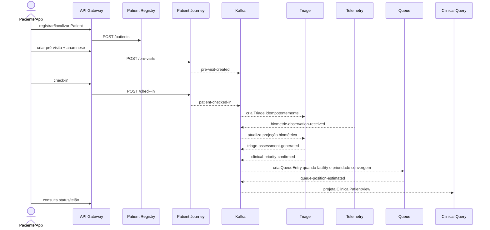

# Choreography E2E — paciente digital

A demo (`scripts/e2e-demo.ps1`) consulta endpoints de lookup e faz **polling de consistência eventual**, em vez de depender de sleeps fixos para Triage, Queue e Clinical View.
